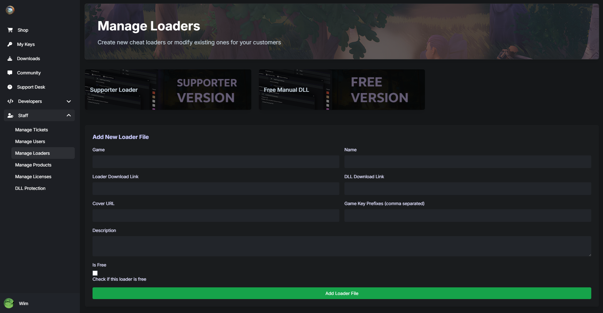
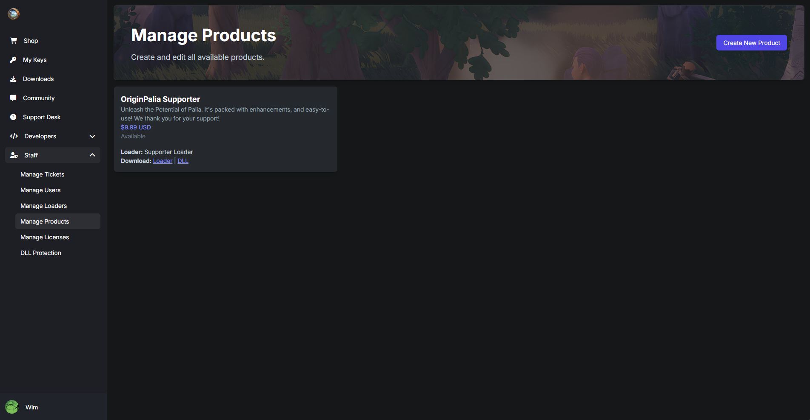

# PayCheat CMS | Full-stack P2C Site

Full-stack CMS built specifically for Pay-to-Cheat (P2C) sites. This project is perfect for those looking to manage a cheat or software distribution service with ease. The system is fully integrated with **MongoDB**, **KeyAuth**, **Stripe API**, and more to ensure seamless user management, license key generation, and product distribution. With a variety of models and routes, this CMS is the all-in-one solution for running a P2C business!

Created and maintained with ❤️ by [Charles Knapp](https://github.com/charlesknapp).

💡 **Live Demo**: Want to see it in action? Check out various sites using PayCheat CMS: [GetOS.me](https://getos.me)

## Features
- **MongoDB** user and product data management
- **KeyAuth** integration for license generation and verification
- **Stripe API** for secure payment processing
- Multiple user roles and community features
- A robust dashboard for developers, users, and admins
- Integrated download and product tracking
- Automated cron jobs for handling background tasks
- Discord community management with webhook integration

## Data Models
Our CMS includes a wide array of data models, each designed to manage specific functions of your platform:

- **activeUser**: Tracks all users with an active license key.
- **apiUsage**: Monitors API usage for throttling and limits.
- **closedReport**: Stores reports that have been resolved or closed.
- **downloadRecord**: Logs each download event for tracking purposes.
- **embedMessage**: Handles messages that are embedded within your platform or external services.
- **generatedKey**: Manages all generated license keys.
- **license**: Stores and manages license key details.
- **loaderFile**: Manages files related to the cheat loader.
- **post**: Stores posts created in your community or forums.
- **product**: Manages the products available for sale, including cheats and other services.
- **profileVisit**: Logs profile visit data for analytics and engagement tracking.
- **reply**: Stores replies to posts or reports in your community.
- **report**: Manages reports created by users for support or issues.
- **supporterRoleCache**: Caches users with a supporter role for better role management.

## API Routes
PayCheat CMS provides a variety of pre-built routes that make managing your platform a breeze:

- **auth**: Handles authentication, including login, registration, and password resets.
- **community**: Manage community posts, replies, and user interaction.
- **cron**: Automates background tasks such as clearing old cache, applying supporter roles, and more.
- **dashboard**: Provides users and admins with a comprehensive view of their data, keys, and usage.
- **developer**: Includes routes for developers to manage products, license keys, and API usage.
- **discord**: Manages Discord integration, including user role syncing and webhook notifications.
- **downloads**: Tracks and manages downloadable files for your users.
- **files**: Handles file uploads and storage.
- **index**: The main landing page route.
- **license**: Routes for generating, validating, and managing license keys.
- **payment**: Integrates with Stripe for processing user payments and purchases.
- **product**: Manages product listings, including cheats and other services available for purchase.
- **profile**: Manages user profiles, including settings, license information, and profile views.
- **reports**: Allows users to create reports for issues or bugs.
- **stats**: Displays platform statistics, including user activity, downloads, and product sales.
- **user**: Manages user data, authentication, and role-based permissions.
- **webhooks**: Provides webhook functionality for real-time integrations, including Discord and payment notifications.

## Why Choose PayCheat CMS?

1. **Seamless Integration**: Pre-built models and routes make it easy to manage users, licenses, and payments.
2. **Scalability**: Built on top of MongoDB, PayCheat CMS can handle thousands of users and product transactions with ease.
3. **Developer-Friendly**: With detailed documentation and a modular architecture, developers can easily extend or modify the CMS.
4. **Community Engagement**: Built-in support for user posts, reports, and replies keeps your community active and engaged.
5. **Secure**: Integrated with Stripe and KeyAuth for secure transactions and license management.
6. **Automation**: Cron routes and background tasks ensure that your platform runs efficiently without manual intervention.

## PayCheat CMS Image Examples
Below are some example screenshots showcasing the sections of PayCheat CMS.

### Product and Key Management

    
    
    

### Community Features

    
    
    

### Support and Developer Tools

    
    
    

### Report and User Management

    
    
    

### Loader and Product Management

    
    
    

### License and DLL Protection

    
    
    

### Dashboard and Profile

    
    
    

## How to Purchase
If you're interested in purchasing the full source code of **PayCheat CMS**, you're in the right place! This CMS is available for sale for individuals or businesses looking to quickly deploy a Pay-to-Cheat platform with a fully-featured backend.

To get the source code and license, please contact:

- **LinkedIn**: https://www.linkedin.com/in/knappcharles/
- **GitHub**: [Charles Knapp](https://github.com/charlesknapp)

Once payment is confirmed via **Stripe**, you'll receive access to the full repository and support to help you set it up.
